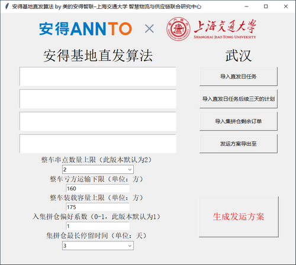

## 安得基地直发算法 
美的安得智联 x 上海交通大学 智慧物流与供应链联合研究中心

### 武汉基地
#### 算法单机版 v2.2 2021.11.1 release 下载[联系交大团队] <!--[[第1部分]](./wuhan/v2/基地直发算法_v2.2.z01) [[第2部分]](./wuhan/v2/基地直发算法_v2.2.zip)-->

* 优化了小单合并
* 考虑了整车在同一线路内的串点
* 考虑了当日订单与未来订单做集拼时的权衡：节省运费 vs 集拼成本
* 支持 Windows 7、10 操作系统，兼容 32 位与 64 位

### 小工具
#### MAC地址查询工具 下载 64位 [[zip]](https://shh1.github.io/annto/MAC地址查询工具.zip) [[exe]](./MAC地址查询工具.exe) 32位 [[zip]](./MAC地址查询工具[兼容版].zip) [[exe]](./MAC地址查询工具[兼容版].exe)
